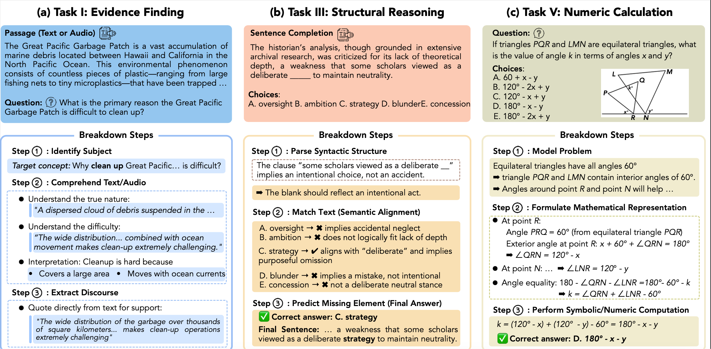

# 🎓 Educational Benchmarks & LLM-Evaluation Suite

A 🚀 **single-stop repository** for evaluating **GPT-family**, **LLaMA**, **Gemini**, and other large-language models on standardized tests such as **GRE**, **GMAT**, **SAT**, **TOEFL**, and **IELTS**.

## 📦 Features

* 📁 **Curated JSON datasets** for each exam section
* 🐍 One dedicated **Python driver per dataset per model**
* 📊 Generic summarizer to convert JSON files into latency/accuracy CSV tables
* 📈 Utility scripts for cross-dataset accuracy aggregation and plotting

---

## 📂 Repository Layout

### 📌 Folder Naming Rules

* `GRE*`: Math, RC, Verbal
* `GMAT/`: Quant, Verbal, Data Insights
* `SAT/`: Math & Reading
* `TOFEL/`: Reading & Listening
* `IELTS/`: Reading & Listening

---

## 📝 Question Type Examples


## 🛠️ Prerequisites

* 🐍 Python ≥ 3.10

---

## ⚡ Quick Start

```bash
pip install g4f

# 📥 Clone the repository
git clone https://github.com/<your-org>/Education.git
cd Education

# 🌱 Set up virtual environment
python -m venv .venv && source .venv/bin/activate

# ▶️ Run dataset example: GRE Math Medium 
cd "GRE Math Medium"
python run_gpt4o.py   # ➜ gre_math_medium_gpt4o.json (includes overall accuracy)

# 📋 Generate Latency CSV
cd ../../tools
python runtime.py ../GRE\ Math\ Medium/gre_math_medium_gpt4o.json \
                  --out ../runtime_gre/gre_math_medium_gpt4o.csv
```

---

## 🤝 Contributing

Your contributions are always welcome! Please:

* Fork 🍴
* Branch 🌿 (`git checkout -b feature/new-feature`)
* Commit 💾 (`git commit -m 'Add awesome feature'`)
* Push 🚀 (`git push origin feature/new-feature`)
* Pull Request 🎉

---

## 🖼️ Visual Breakdown Illustration



## 📜 License

Distributed under the MIT License 📄. See [`LICENSE`](LICENSE) for more information.
